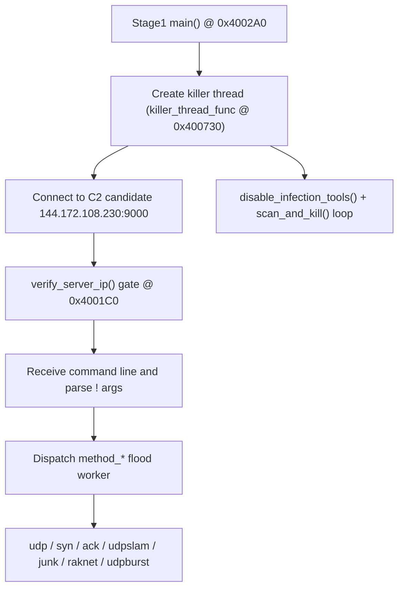

# Mirai Stage Flow (Sample-Specific)

Sample: `input/d40cf9c95dcedf4f19e4a5f5bb744c8e98af87eb5703c850e6fda3b613668c28.elf`

## Key Offsets

- `0x4002A0`: `main`
- `0x4001C0`: `verify_server_ip`
- `0x41498A`: authorized server IP string (`144.172.108.230`)
- `0x4149C6`: `!SIGKILL` command token
- `0x400730`: `killer_thread_func`
- `0x400A10`: `disable_infection_tools`
- `0x400D60`: `scan_and_kill`

