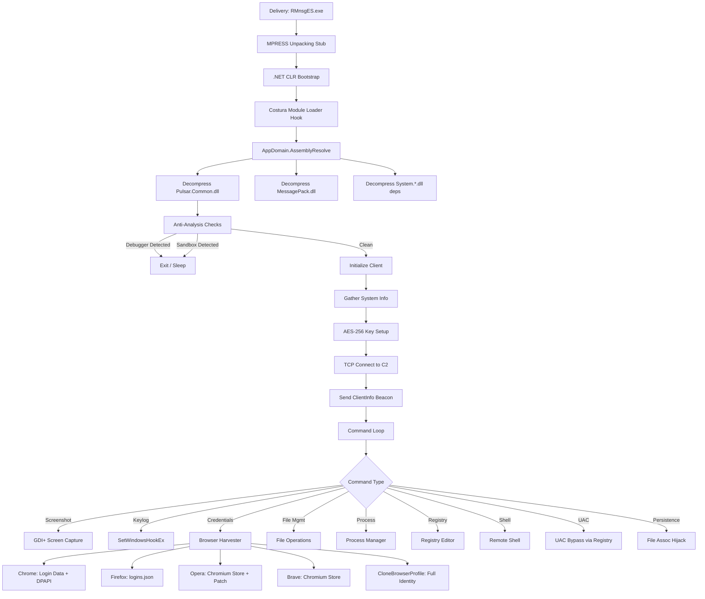
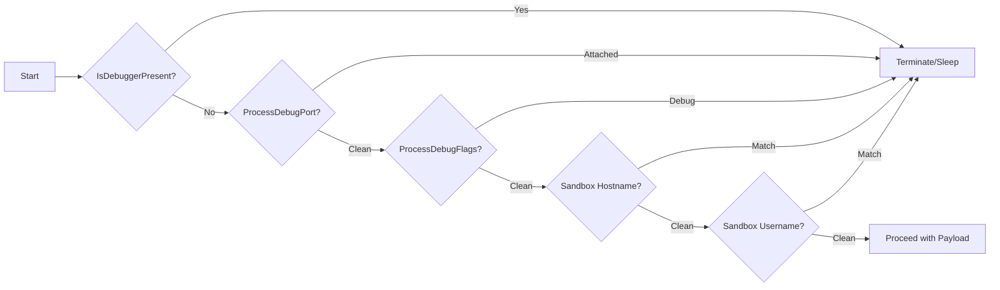
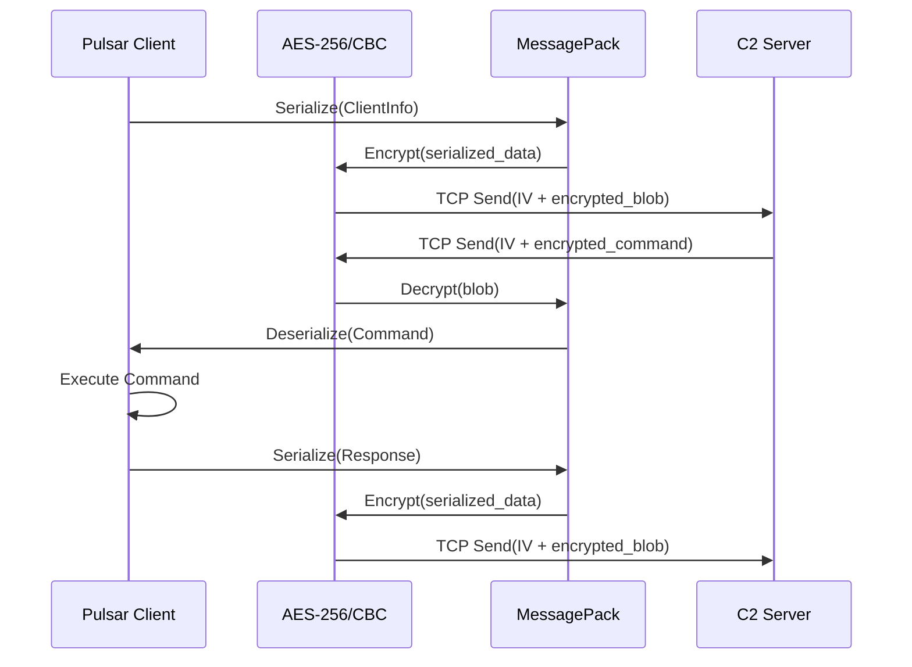

# Pulsar RAT - Execution Stage Flow

## Infection Chain

```mermaid
graph TD
    A[Delivery: RMnsgES.exe] --> B[MPRESS Unpacking Stub]
    B --> C[.NET CLR Bootstrap]
    C --> D[Costura Module Loader Hook]
    D --> E[AppDomain.AssemblyResolve]
    E --> F[Decompress Pulsar.Common.dll]
    E --> G[Decompress MessagePack.dll]
    E --> H[Decompress System.*.dll deps]
    
    F --> I[Anti-Analysis Checks]
    I -->|Debugger Detected| J[Exit / Sleep]
    I -->|Sandbox Detected| J
    I -->|Clean| K[Initialize Client]
    
    K --> L[Gather System Info]
    L --> M[AES-256 Key Setup]
    M --> N[TCP Connect to C2]
    N --> O[Send ClientInfo Beacon]
    O --> P[Command Loop]
    
    P --> Q{Command Type}
    Q -->|Screenshot| R[GDI+ Screen Capture]
    Q -->|Keylog| S[SetWindowsHookEx]
    Q -->|Credentials| T[Browser Harvester]
    Q -->|File Mgmt| U[File Operations]
    Q -->|Process| V[Process Manager]
    Q -->|Registry| W[Registry Editor]
    Q -->|Shell| X[Remote Shell]
    Q -->|UAC| Y[UAC Bypass via Registry]
    Q -->|Persistence| Z[File Assoc Hijack]
    
    T --> T1[Chrome: Login Data + DPAPI]
    T --> T2[Firefox: logins.json]
    T --> T3[Opera: Chromium Store + Patch]
    T --> T4[Brave: Chromium Store]
    T --> T5[CloneBrowserProfile: Full Identity]
```

## Anti-Analysis Decision Tree

```mermaid
graph LR
    A[Start] --> B{IsDebuggerPresent?}
    B -->|Yes| X[Terminate/Sleep]
    B -->|No| C{ProcessDebugPort?}
    C -->|Attached| X
    C -->|Clean| D{ProcessDebugFlags?}
    D -->|Debug| X
    D -->|Clean| E{Sandbox Hostname?}
    E -->|Match| X
    E -->|Clean| F{Sandbox Username?}
    F -->|Match| X
    F -->|Clean| G[Proceed with Payload]
```

## C2 Message Flow

```mermaid
sequenceDiagram
    participant Client as Pulsar Client
    participant AES as AES-256/CBC
    participant MP as MessagePack
    participant C2 as C2 Server
    
    Client->>MP: Serialize(ClientInfo)
    MP->>AES: Encrypt(serialized_data)
    AES->>C2: TCP Send(IV + encrypted_blob)
    
    C2->>AES: TCP Send(IV + encrypted_command)
    AES->>MP: Decrypt(blob)
    MP->>Client: Deserialize(Command)
    
    Client->>Client: Execute Command
    
    Client->>MP: Serialize(Response)
    MP->>AES: Encrypt(serialized_data)
    AES->>C2: TCP Send(IV + encrypted_blob)
```
